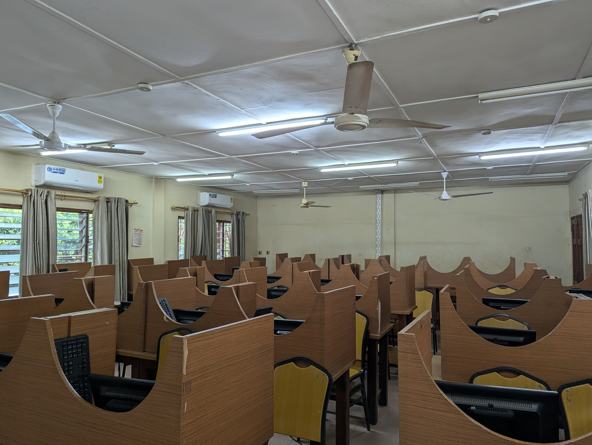

# Cartoonize using OpenCV

To run You need this Package
`pip install opencv-python`

When Calling the function, change the name to the name of your Image.

### Initial Image

### This is a sample Result.

